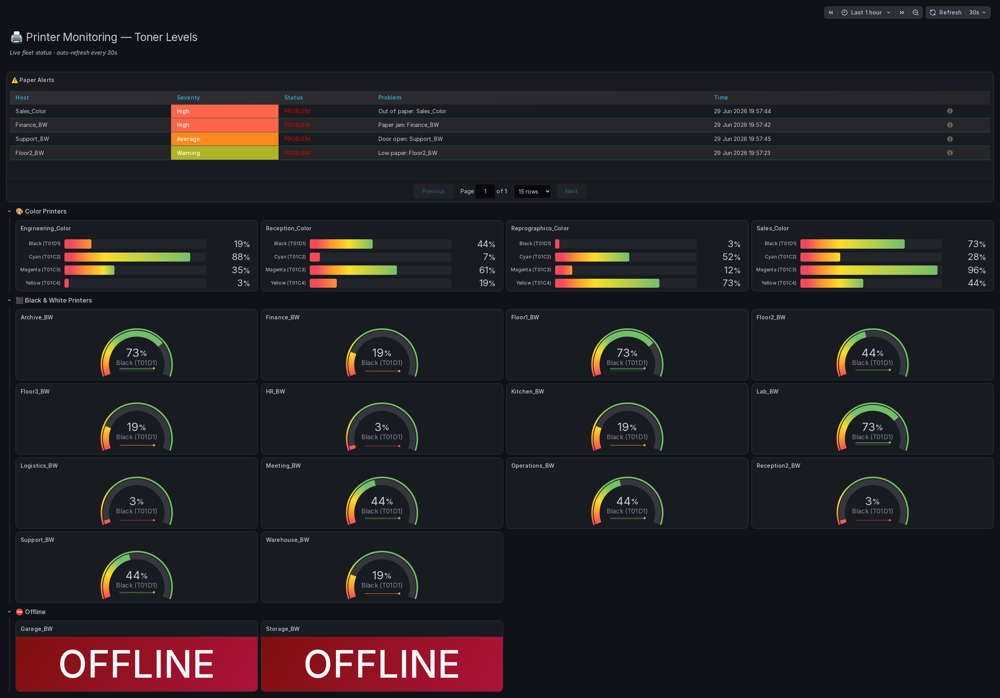

# 🖨️ Zabbix Printer Monitoring


[](https://github.com/bytedump/zabbix-printer-monitoring/actions/workflows/ci.yml)

A Dockerized **Zabbix + Grafana** stack that centrally monitors the toner levels **and paper status** (jams, out-of-paper, low paper, door open) of a network printer fleet — collecting data over SNMP and auto-generating a TV-friendly **kiosk dashboard** through the Zabbix and Grafana APIs.

## 📸 Preview



> A **paper-alert banner** tops the view — it stays empty while the fleet is healthy and fills with severity-coloured rows (paper jam, out of paper, low paper, door open) the moment a Zabbix trigger fires. Below it: live toner levels for the whole fleet — colour printers as CMYK bars, B&W printers as gauges, and offline units flagged in red, grouped into sections. The whole dashboard is generated by `create_dashboard.py`.

## 🧱 Stack

Zabbix (PostgreSQL · Server · Web) · Grafana · `alexanderzobnin-zabbix-datasource` · Python · Docker · SNMP (`Printer-MIB`) · snmpsim (mock fleet)

## Table of Contents

- [How it works](#-how-it-works)
- [How to use](#-how-to-use)
  - [1. Configure Credentials](#1-configure-credentials)
  - [2. Start the Containers](#2-start-the-containers)
  - [3. Configure Printers in Zabbix](#3-configure-printers-in-zabbix)
  - [4. Configure Grafana & Generate Dashboard](#4-configure-grafana--generate-dashboard)
- [Demo mode (no physical printers)](#-demo-mode-no-physical-printers)
- [License](#-license)

## 📌 How it works

The project uses the official Zabbix stack (PostgreSQL Database, Zabbix Server, Zabbix Web) and Grafana, integrated by the **alexanderzobnin-zabbix-datasource** plugin.

- **Data Collection:** Zabbix discovers printer data using the SNMP protocol and the "Generic by SNMP" template, fetching toner levels from the standard `Printer-MIB`.
- **Paper alerts:** Zabbix also polls `hrPrinterDetectedErrorState` (Host-Resources-MIB) — a single bit field that flags paper jams, out-of-paper, low paper and an open door. A JavaScript preprocessing step decodes the byte to an integer, and one trigger per condition (`bitand` on the matching bit) raises a Zabbix problem that the dashboard's alert banner shows. Polling (not SNMP traps) keeps this consistent across printer models.
- **SNMP Versions:** Most network printers support SNMPv2c, but we detected that older Epson models require **SNMPv1** to avoid *Timeouts*.
- **Visualization (Grafana):** A Python script consumes the Zabbix API to get the list of active printers and consumes the Grafana API to dynamically build the Dashboard.

## 🚀 How to use

### 1. Configure Credentials
An `.env.example` file has been created. Copy it to a new `.env` file and adjust your passwords accordingly:

```bash
cp .env.example .env
```

### 2. Start the Containers
Use Docker Compose to spin up the entire ecosystem:

```bash
docker compose up -d
```
*This will initialize the Zabbix Server on port 10051, the Web Interface on port 8080, and Grafana on port 3000.*

### 3. Configure Printers in Zabbix
Printers must be manually registered in Zabbix. Follow these steps:
1. Open the Zabbix Web Interface (`http://localhost:8080`) and login with your credentials (`Admin` / `zabbix` by default).
2. Navigate to **Data collection -> Hosts** and click **Create host**.
3. In the **Host** tab:
   - **Host name:** Enter a recognizable name (e.g., `Finance_BW`).
   - **Templates:** Link the template `Generic by SNMP`.
   - **Host groups:** Select or create a group (e.g., `Printers`).
   - **Interfaces:** Add an `SNMP` interface. Enter the printer's IP address and keep port `161`.
     - *Important:* For modern printers, select **SNMPv2**. For older Epson printers, select **SNMPv1** (otherwise Zabbix will show an SNMP Timeout and the host will go OFFLINE).
   - **SNMP community:** Usually `public` (unless changed on the printer).
4. Click **Add**. Zabbix's Low-Level Discovery (LLD) will run in the background (usually takes a few minutes) to automatically find the toner items based on the `Printer-MIB`.

### 4. Configure Grafana & Generate Dashboard
To visualize the data, you must link Zabbix to Grafana and run the generator script:

1. Open Grafana (`http://localhost:3000`) and login (`admin` / `admin`).
2. Navigate to **Connections -> Data sources** and click **Add data source**.
3. Search for **Zabbix** (the plugin is pre-installed in our Docker image).
4. Configure the Zabbix Data Source:
   - **URL:** `http://zabbix-web:8080/api_jsonrpc.php`
   - **Zabbix API details:** Enable it, set Username to `Admin` and Password to `zabbix`.
   - Click **Save & test**. It should say "Zabbix API version: 6.4.x".
5. Now, generate the Dashboard automatically by running the Python script:

```bash
# Install the Python dependencies first (pip install -r requirements.txt)
python3 create_dashboard.py
```

> **Tip — panels show "No data" after adding hosts?** The Zabbix datasource caches its host/item list (default ~1h). If you register printers and the panels stay empty even though Zabbix has values, restart Grafana (`docker compose restart grafana`) or lower the datasource's cache TTL.

The script will:
1. Read the local `.env` file for API credentials.
2. Connect to the Zabbix API to find all registered printers, checking if they are Color, B&W, or Offline.
3. Connect to the Grafana API to automatically find the Zabbix Data Source UID.
4. Format a Dashboard JSON using a user-friendly mosaic layout (4 columns).
5. Send the request to the Grafana API to save the panel.
6. Return a formatted URL to access the dashboard in Kiosk mode (ideal for external monitors without visual interference from the standard Grafana interface).

## 🧪 Demo mode (no physical printers)

Want to try the dashboard — or tweak its visuals — without a real printer fleet? A bundled **SNMP simulator** (`snmp-sim` service, built from `mock/snmp/`) fakes the whole fleet over SNMP, so the exact same data path (SNMP → Zabbix → Grafana) runs end to end on your machine.

```bash
# 1. Credentials (same as above)
cp .env.example .env

# 2. Python dependencies for the helper scripts
pip install -r requirements.txt

# 3. Generate the fake SNMP data files (uses printers.example.json by default)
python3 generate_snmprec.py

# 4. Start everything, including the simulator
docker compose up -d --build

# 5. Wait ~1-2 min for Zabbix to initialize its database on first boot, then
#    auto-register the fleet as Zabbix hosts pointing at the simulator
python3 register_hosts.py

# 6. Add the Zabbix data source in Grafana (see step 4 above), then build the dashboard
python3 create_dashboard.py
```

What the mock layer does:

- **`generate_snmprec.py`** reads the inventory and writes one `mock/snmp/data/<name>.snmprec` per printer. Mono printers expose a single Black toner; colour printers expose CMYK. Toner levels are spread across every threshold band (green → red) so you can see each panel state. Each printer also exposes an `hrPrinterDetectedErrorState` byte; a few demo printers are given a non-zero state (jam / out of paper / low paper / door open) so the alert banner has something to show.
- **`register_hosts.py`** creates the Zabbix hosts, SNMP toner items, the error-state item (with its decode preprocessing) and the four paper triggers through the API, so you skip the manual host creation in step 3. Re-running it is safe — existing hosts are skipped.
- A couple of printers (`Garage_BW`, `Storage_BW`) are left **offline** on purpose to exercise the dashboard's `OFFLINE` panel.
- The demo paper states are keyed to the **example** fleet names only, so a real `printers.json` reports a clean state and the banner shows genuine paper errors — never a fabricated one.
- **Inventory:** the tracked `printers.example.json` drives the demo. To monitor your real fleet, drop a git-ignored `printers.json` beside it — the scripts pick it up automatically.

> The simulator listens on `snmp-sim:1161` inside the Compose network only — Zabbix polls it just like a real printer. To monitor real printers instead, follow [How to use](#-how-to-use) and point the hosts at their real IPs.

## 📄 License

Released under the [MIT License](LICENSE).
